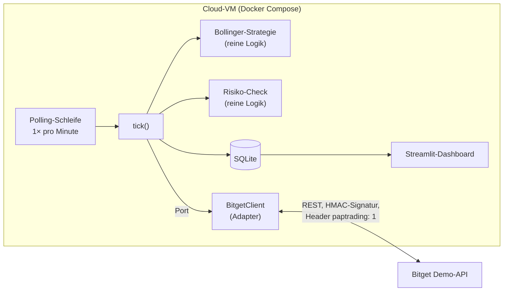

# Bollinger-Bot

Ein Krypto-Trading-Bot in Python, der mit der Bollinger-Strategie auf dem **Demo-Konto** von
Bitget handelt, also mit Spielgeld. Projektarbeit im Modul 450 «Applikationen testen» an der TBZ.

> [!NOTE]
> Schulprojekt mit Fokus auf Testing. Der Bot handelt ausschliesslich im Demo-Modus von Bitget.
> Nichts hier ist eine Anlageberatung.

- **Team:** Nicolas Hunger, Lucas Weisshaar und Valentin Ernst
- **Modul:** M450 «Applikationen testen», TBZ, Klasse WUP25
- **Abgabe und Präsentation:** Mi 28.10.2026

## Idee

Der Bot läuft rund um die Uhr in einem Container auf einer Cloud-VM:

1. Einmal pro Minute fragt er über die REST-API von Bitget nach, ob eine neue Kerze abgeschlossen ist.
2. Wenn ja, berechnet er die Bollinger-Bänder aus den letzten Schlusskursen.
3. Schliesst eine Kerze unter dem unteren Band, kauft er. Wann er verkauft (oberes Band oder
   Mittelband), legen wir noch fest.
4. Ein Risiko-Check begrenzt die Positionsgrösse und rundet Menge und Preis auf die Stellen, die
   Bitget erlaubt.
5. Signale, Trades und Kontostand speichert er in SQLite. Ein Streamlit-Dashboard zeigt den Kurs
   mit den Bändern, die Käufe und Verkäufe und den Kontostand.

### Bollinger-Bänder in Kürze

- **Mittelband:** Durchschnitt der letzten n Schlusskurse (Standard: n = 20)
- **Oberes und unteres Band:** Mittelband ± k · σ (Standard: k = 2)
- **σ:** Standardabweichung derselben n Kurse, geteilt durch n (nicht durch n − 1)
- **Idee dahinter (Mean Reversion):** Ein Kurs weit unter dem Durchschnitt kehrt eher zur Mitte
  zurück.

Beispiel mit n = 3, k = 2 und den Kursen 10, 12, 14: Mittelband 12, σ ≈ 1.633, Bänder bei 8.73
und 15.27. Mit σ geteilt durch n − 1 kämen 8.00 und 16.00 heraus, ein typischer Fehler.

## Architektur



- **`tick()`** enthält einen ganzen Durchgang: Kerzen holen, Signal berechnen, Risiko prüfen,
  eventuell eine Order platzieren, speichern. Die Polling-Schleife ruft nur `tick()` auf.
- **Port:** `tick()` kennt die Börse nur über eine Schnittstelle. In den Tests ersetzt ein Mock
  den echten `BitgetClient`.
- **Strategie und Risiko-Check** sind reine Funktionen ohne I/O und darum einfach zu testen.

## Stack

| Bereich | Werkzeug |
|---|---|
| Sprache | Python |
| Börse | Bitget REST-API im Demo-Modus |
| HTTP | httpx |
| Datenhaltung | SQLite |
| Dashboard | Streamlit |
| Tests | pytest, pytest-mock, respx, pytest-cov |
| CI/CD | GitHub Actions, SonarQube Cloud, GitHub Pages, GitHub Container Registry |
| Betrieb | Docker Compose auf einer Cloud-VM |

## Teststrategie

_Entwurf, wird im Projekt verfeinert._

| Ebene | Was wird getestet | Werkzeug |
|---|---|---|
| Unit | Bollinger-Berechnung, Kauf- und Verkaufsregeln, Risiko-Check (Rundung und Mindestbetrag, also Grenzwerte), Request-Signatur | pytest |
| Integration | `BitgetClient` gegen gemockte HTTP-Antworten, Speichern in einer echten temporären SQLite-DB, `tick()` von der Kerze bis zur DB, Backtest auf aufgezeichneten Kursen | pytest, respx |
| E2E | Dashboard mit Testdaten | Streamlit `AppTest` oder Playwright |

### Was wird gemockt?

| Schnittstelle | Womit | Warum |
|---|---|---|
| Börse (Port) in den `tick()`-Tests | pytest-mock | Ablauf und Entscheide testen, ohne HTTP |
| Bitget-HTTP in den Client-Tests | respx | Requests und Signatur prüfen, ohne Netzwerk |
| Uhr | Fake-Uhr | «Ist die Kerze fertig?» testen, ohne zu warten |

### Grundsätze

- **Keine echten API-Aufrufe in der Pipeline.** Bitget ist in allen automatischen Tests gemockt.
- **Soll-Werte von Hand nachgerechnet** (Taschenrechner oder Tabellenkalkulation), nicht mit
  derselben Bibliothek erzeugt, die getestet wird.
- **Reports:** JUnit-XML und HTML-Testreport auf GitHub Pages, Coverage in SonarQube Cloud.

## Pipeline

```text
Build ──► Test ──► Deploy (nur auf main, nur wenn alle Tests grün sind)
           │        ├─ Testreport   → GitHub Pages
           │        ├─ Docker-Image → GitHub Container Registry
           │        └─ Cloud-VM     → docker compose pull && docker compose up -d
           └─ JUnit-XML → Testresultate im PR, coverage.xml → SonarQube Cloud
```

## Geheimnisse

- Die Bitget-Demo-Keys liegen nur auf der VM, als Umgebungsvariablen in einer `.env`-Datei, die
  per `.gitignore` ausgeschlossen ist.
- Die Pipeline braucht keine Bitget-Keys, nur ein Sonar-Token und einen SSH-Schlüssel für das
  Deployment, beide als GitHub Secrets.

## Planung

_Entwurf, wird im Projekt verfeinert._

| Wann | Ziel |
|---|---|
| bis Mi 30.09. | Grundgerüst, Pipeline mit Build und Test, SonarQube Cloud angebunden, erste Bausteine |
| Mi 30.09. (Unterricht CI/CD und Deployment) | Deploy-Stage auf die Cloud-VM |
| Herbstferien | Bitget-Client, Risiko-Check, `tick()` mit Polling, SQLite, Dashboard. Der Bot läuft spätestens Mitte Ferien auf der VM. |
| Mi 21.10. (Unterricht Code Reviews) | Offene PRs abschliessen, Reflexion schreiben |
| Mi 28.10. | Doku fertig, Präsentation (10 Minuten) |

### Arbeitspakete

Jedes Paket bekommt einen eigenen Branch und Pull Request, die andere Person reviewt ihn. Ziel:
mindestens 3 aktiv diskutierte PRs pro Person.

| # | Paket | Wer |
|---|---|---|
| 1 | Bollinger-Berechnung | offen |
| 2 | Kauf- und Verkaufsregeln | offen |
| 3 | Bitget-Client: Signatur und Kerzen | offen |
| 4 | Bitget-Client: Orders und Kontostand | offen |
| 5 | Risiko-Check | offen |
| 6 | `tick()`, Polling-Schleife und SQLite | offen |
| 7 | Dashboard | offen |
| 8 | Pipeline und Deploy auf die VM | offen |

### Offene Entscheide

- Spot oder USDT-M-Futures? Im Demo-Modus von Bitget prüfen, ob Spot angeboten wird. Sonst
  Futures mit Hebel 1 und nur Long-Positionen.
- Handelspaar (z.B. BTCUSDT) und Kerzen-Intervall (z.B. 15 Minuten)
- Verkaufsregel (oberes Band oder Mittelband) und Stop-Loss
- Anbieter der Cloud-VM (z.B. Hetzner oder Infomaniak)

## Testkonzept

_Folgt, klein gehalten nach der
[Vorlage aus den Kursunterlagen](https://gitlab.com/ch-tbz-it/Stud/m450/m450/-/blob/main/Unterlagen/testkonzept/README.md)._

## Reflexion

_Folgt am Projektende (gemäss Eckdaten: Code Reviews und TDD)._

## KI-Nutzung

Gemäss Projektvorgaben deklarieren wir, ob und wie wir KI einsetzen. Die Liste wird laufend
nachgeführt.

- **Als Nachschlagewerk:** Claude Code (Anthropic) für die Projektfindung per Interview, für
  Recherchen (Bitget-Demo-API, Test-Werkzeuge für COBOL) und zur Erklärung der Bollinger-Bänder.
- **Für die Dokumentation:** Den ersten Entwurf dieses READMEs hat Claude Code aus unserem
  Interview erstellt.
- **Zum Schreiben von Code:** _noch offen_
- **Zum automatischen Erstellen von Code durch einen Agenten:** _noch offen_
- **Zum Reviewen oder Optimieren:** _noch offen_

## Kursunterlagen

- [Projekt: Rahmenbedingungen und Bewertungsrubrik](https://gitlab.com/ch-tbz-it/Stud/m450/m450/-/blob/main/Unterlagen/projekt/README.md)
- [Eckdaten](https://gitlab.com/ch-tbz-it/Stud/m450/m450/-/blob/main/Unterlagen/projekt/grundaufbau.md)
- [CI/CD im Projekt](https://gitlab.com/ch-tbz-it/Stud/m450/m450/-/blob/main/Unterlagen/projekt/ci-cd.md)
- [Code Reviews im Projekt](https://gitlab.com/ch-tbz-it/Stud/m450/m450/-/blob/main/Unterlagen/projekt/code-reviews.md)
